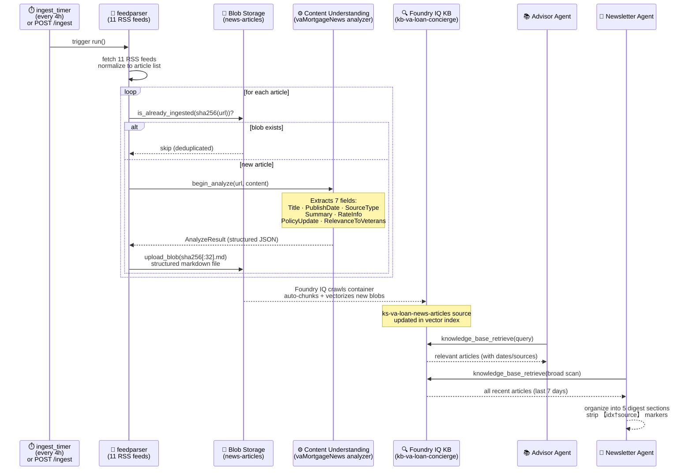
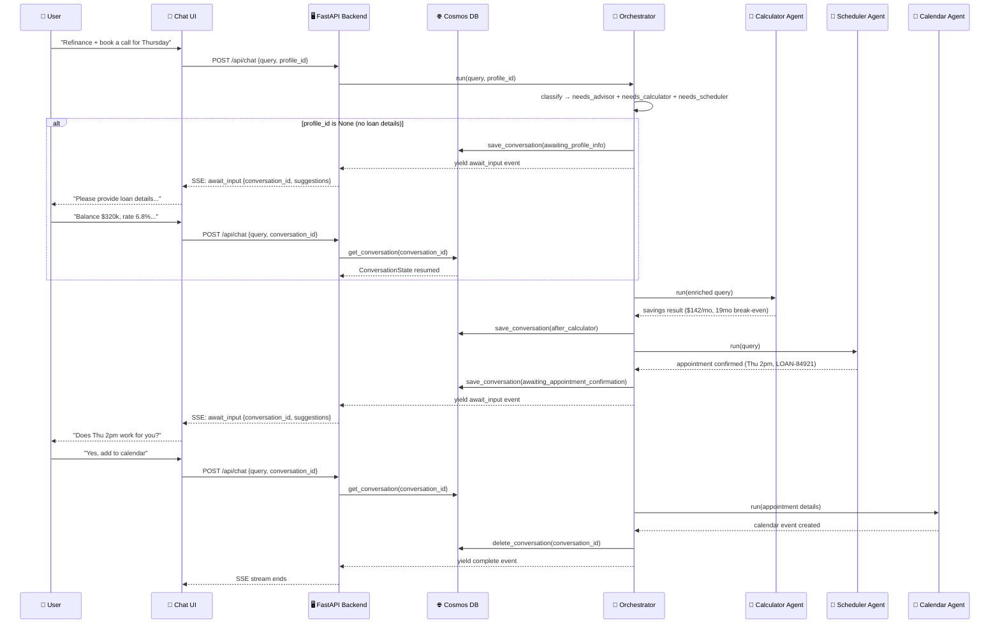
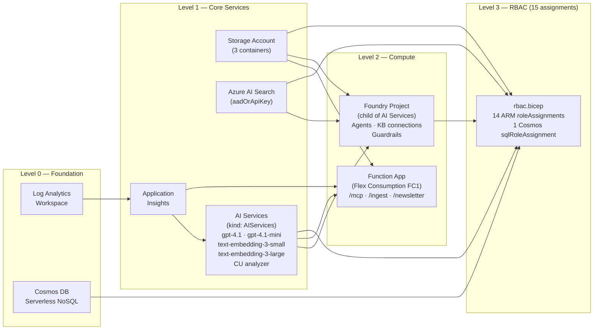

# VA Loan Concierge — Solution Architecture

## Full Architecture

```mermaid
graph TB
    %% ── External Users ───────────────────────────────────────────────
    Veteran["👤 Veteran / User"]
    Teams["📱 Microsoft Teams\n/ M365 Copilot"]
    RSS["🌐 RSS Feeds\n(11 sources:\nVA.gov · CFPB · Freddie Mac\nMortgage News Daily · HousingWire\nMBA · Census · NY Fed · etc.)"]

    %% ── React UI ─────────────────────────────────────────────────────
    subgraph UI["Browser — React UI (Vite + Tailwind)"]
        Chat["💬 Chat Panel\n(conversation history,\npartial responses,\nHIL suggestion buttons)"]
        FlowLog["📊 Agent Flow Log\n(streaming SSE events,\nreasoning trace,\ntool calls)"]
        Input["⌨️ Chat Input\n(prompt + demo buttons)"]
    end

    %% ── FastAPI Backend ──────────────────────────────────────────────
    subgraph Backend["FastAPI Backend — api/server.py  (port 8000)"]
        Server["POST /api/chat\n→ SSE stream\n(orchestrator_start …\npartial_response …\ncomplete)"]
        Telemetry["📈 OpenTelemetry\n(chat_request span,\nper-agent spans)"]
        ConvState["🗄️ Conversation State\n(Cosmos DB primary,\nin-memory fallback)"]
    end

    %% ── Azure Infrastructure ─────────────────────────────────────────
    subgraph Azure["Microsoft Azure"]

        %% ── AI Services / Foundry ────────────────────────────────────
        subgraph Foundry["AI Services (kind: AIServices) + Foundry Project"]
            direction TB
            GPT41["🧠 GPT-4.1\n(agent LLM)"]
            GPT41Mini["🧠 GPT-4.1-mini\n(CU extraction)"]
            EmbSmall["📐 text-embedding-3-small\n(KB vectorization)"]
            EmbLarge["📐 text-embedding-3-large\n(CU embeddings)"]
            CU["⚙️ Content Understanding\n(ContentUnderstandingClient)\nAnalyzer: vaMortgageNews\n7 fields: Title · PublishDate\nSourceType · Summary\nRateInfo · PolicyUpdate\nRelevanceToVeterans"]

            subgraph Agents["Foundry Agents (Responses API + agent_reference)"]
                Orch["🔀 Orchestrator\nva-loan-orchestrator\n5-way routing:\nadvisor · calculator\nscheduler · newsletter\ngeneral"]
                Advisor["📚 Advisor Agent\nva-loan-advisor-iq\nFoundry IQ / KB MCP\n11 knowledge sources"]
                Calculator["🧮 Calculator Agent\nCustom MCP\nrefi_savings_calculator"]
                Scheduler["📅 Scheduler Agent\nCustom MCP\nappointment_scheduler"]
                Newsletter["📰 Newsletter Agent\nva-loan-newsletter-iq\nFoundry IQ / KB MCP\n5-section digest"]
                Calendar["📆 Calendar Agent\nWork IQ Calendar MCP\nCreateEvent (M365)"]
            end

            WorkflowAgent["📋 Workflow Agent\nva-loan-concierge-workflow\n(Foundry Workflow YAML v13)\nDeclarative orchestration\nfor Teams / Copilot Studio"]
        end

        %% ── Azure AI Search ──────────────────────────────────────────
        subgraph Search["Azure AI Search"]
            KB["🔍 Foundry IQ KB\nkb-va-loan-concierge\n(MCP endpoint)"]
            KBSrc1["📄 ks-loan-guidelines\n(11 VA topic docs)"]
            KBSrc2["📰 ks-va-loan-news-articles\n(CU-ingested news)"]
        end

        %% ── Storage Account ──────────────────────────────────────────
        subgraph Storage["Azure Blob Storage"]
            BlobGuidelines["📁 loan-guidelines\n(11 static KB docs)"]
            BlobNews["📁 news-articles\n(CU-ingested\nstructured .md files\nsha256 filenames)"]
            BlobDeploy["📦 deploymentpackage\n(Flex Consumption\nFunction App deploy)"]
        end

        %% ── Function App (MCP Server + Ingestion) ────────────────────
        subgraph FuncApp["Azure Function App — Flex Consumption (FC1)"]
            direction TB
            MCPServer["🔌 POST /mcp\nMCP JSON-RPC server\n(initialize · tools/list · tools/call)"]
            RefiTool["💰 refi_savings_calculator\n(monthly savings, annual savings,\nbreak-even timeline)"]
            ApptTool["📅 appointment_scheduler\n(loan officer, date, confirmation #)"]

            subgraph CUPipeline["📡 Content Understanding Pipeline"]
                direction LR
                IngestTimer["⏱️ ingest_timer\n(every 4 hours)"]
                IngestHTTP["🌐 POST /ingest\n(manual / on-demand)"]
                FeedParser["📡 feedparser\n(fetch + normalize\n11 RSS feeds)"]
                Dedup["🔑 Deduplication\nsha256(url) blob exists?"]
                CUAnalyze["⚙️ CU begin_analyze()\n(async, waits for completion)"]
                BlobWrite["💾 write_to_blob()\n(structured markdown)"]
                IngestTimer --> FeedParser
                IngestHTTP --> FeedParser
                FeedParser --> Dedup
                Dedup -->|"new article"| CUAnalyze
                Dedup -->|"already ingested"| Skip(("skip"))
                CUAnalyze --> BlobWrite
            end

            subgraph NewsletterTriggers["📰 Newsletter Triggers"]
                NLTimer["⏱️ newsletter_timer\n(Monday 09:00 UTC)"]
                NLHTTP["🌐 POST /newsletter\n(manual / on-demand)"]
            end
        end

        %% ── Cosmos DB ────────────────────────────────────────────────
        CosmosDB["🌐 Cosmos DB\nServerless NoSQL\ncontainer: conversation-state\npartition: /conversation_id\nTTL: 600s\n(HIL state persistence)"]

        %% ── Work IQ Calendar ─────────────────────────────────────────
        WorkIQ["📆 Work IQ Calendar\n(Microsoft-hosted MCP)\nM365 Calendar — CreateEvent"]

        %% ── Monitoring ───────────────────────────────────────────────
        AppInsights["📊 Application Insights\n+ Log Analytics\n(OTel spans, traces,\nper-agent latency)"]
    end

    %% ── M365 ─────────────────────────────────────────────────────────
    M365Cal["📅 M365 Calendar\n(Veteran's personal calendar)"]

    %% ── Connections ──────────────────────────────────────────────────

    %% User → UI
    Veteran --> UI
    UI --> Backend

    %% Teams path
    Teams --> WorkflowAgent

    %% Backend → Orchestrator
    Server --> Orch
    Server --> ConvState
    ConvState --> CosmosDB
    Telemetry --> AppInsights

    %% Orchestrator → Sub-agents
    Orch --> Advisor
    Orch --> Calculator
    Orch --> Scheduler
    Orch --> Newsletter
    Orch --> Calendar

    %% Advisor + Newsletter → KB MCP
    Advisor --> KB
    Newsletter --> KB

    %% KB → Sources
    KB --> KBSrc1
    KB --> KBSrc2

    %% Sources → Blob
    KBSrc1 --> BlobGuidelines
    KBSrc2 --> BlobNews

    %% Calculator + Scheduler → Function App MCP
    Calculator --> MCPServer
    Scheduler --> MCPServer
    MCPServer --> RefiTool
    MCPServer --> ApptTool

    %% Calendar → Work IQ
    Calendar --> WorkIQ
    WorkIQ --> M365Cal

    %% CU Pipeline flow
    RSS --> FeedParser
    BlobWrite --> BlobNews
    CUAnalyze -->|"analyze_article()"| CU

    %% Newsletter triggers → Newsletter Agent (via resolve_version)
    NLTimer --> Newsletter
    NLHTTP --> Newsletter

    %% Foundry IQ auto-vectorizes blobs
    BlobNews -->|"Foundry IQ crawls\nauto-vectorizes"| KBSrc2
    BlobGuidelines -->|"Foundry IQ crawls\nauto-vectorizes"| KBSrc1

    %% LLM deployments used by agents + CU
    GPT41 -.->|"LLM"| Agents
    GPT41Mini -.->|"CU extraction"| CU
    EmbSmall -.->|"KB vectors"| KB
    EmbLarge -.->|"CU embeddings"| CU

    %% Workflow agent uses same sub-agents
    WorkflowAgent -.->|"InvokeAzureAgent"| Advisor
    WorkflowAgent -.->|"InvokeAzureAgent"| Calculator
    WorkflowAgent -.->|"InvokeAzureAgent"| Scheduler
    WorkflowAgent -.->|"InvokeAzureAgent"| Calendar

    %% Telemetry
    Backend -.->|"OTel spans"| AppInsights
    FuncApp -.->|"App Insights"| AppInsights

    %% Styling
    classDef azure fill:#0078D4,stroke:#005A9E,color:#fff
    classDef foundry fill:#5C2D91,stroke:#4B0082,color:#fff
    classDef storage fill:#00BCF2,stroke:#0086C1,color:#fff
    classDef func fill:#FF6900,stroke:#D45600,color:#fff
    classDef ui fill:#107C10,stroke:#0A5A0A,color:#fff
    classDef external fill:#666,stroke:#444,color:#fff
    classDef cosmos fill:#00BCF2,stroke:#0086C1,color:#fff
    classDef monitor fill:#F7630C,stroke:#C44F00,color:#fff

    class Foundry,Agents,Orch,Advisor,Calculator,Scheduler,Newsletter,Calendar,WorkflowAgent,GPT41,GPT41Mini,EmbSmall,EmbLarge,CU foundry
    class Search,KB,KBSrc1,KBSrc2 azure
    class Storage,BlobGuidelines,BlobNews,BlobDeploy storage
    class FuncApp,MCPServer,RefiTool,ApptTool,CUPipeline,IngestTimer,IngestHTTP,FeedParser,Dedup,CUAnalyze,BlobWrite,NewsletterTriggers,NLTimer,NLHTTP func
    class UI,Chat,FlowLog,Input ui
    class Backend,Server,Telemetry,ConvState azure
    class CosmosDB cosmos
    class AppInsights monitor
    class RSS,Veteran,Teams,M365Cal external
```

---

## Content Understanding Pipeline (Detail)

```mermaid
sequenceDiagram
    participant Timer as ⏱️ ingest_timer<br/>(every 4h)<br/>or POST /ingest
    participant FP as 📡 feedparser<br/>(11 RSS feeds)
    participant Blob as 📁 Blob Storage<br/>(news-articles)
    participant CU as ⚙️ Content Understanding<br/>(vaMortgageNews analyzer)
    participant FIQKB as 🔍 Foundry IQ KB<br/>(kb-va-loan-concierge)
    participant Advisor as 📚 Advisor Agent
    participant Newsletter as 📰 Newsletter Agent

    Timer->>FP: trigger run()
    FP->>FP: fetch 11 RSS feeds<br/>normalize to article list
    loop for each article
        FP->>Blob: is_already_ingested(sha256(url))?
        alt blob exists
            Blob-->>FP: skip (deduplicated)
        else new article
            FP->>CU: begin_analyze(url, content)
            Note over CU: Extracts 7 fields:<br/>Title · PublishDate · SourceType<br/>Summary · RateInfo<br/>PolicyUpdate · RelevanceToVeterans
            CU-->>FP: AnalyzeResult (structured JSON)
            FP->>Blob: upload_blob(sha256[:32].md)<br/>structured markdown file
        end
    end
    Blob-->>FIQKB: Foundry IQ crawls container<br/>auto-chunks + vectorizes new blobs
    Note over FIQKB: ks-va-loan-news-articles source<br/>updated in vector index

    Advisor->>FIQKB: knowledge_base_retrieve(query)
    FIQKB-->>Advisor: relevant articles (with dates/sources)

    Newsletter->>FIQKB: knowledge_base_retrieve(broad scan)
    FIQKB-->>Newsletter: all recent articles (last 7 days)
    Newsletter-->>Newsletter: organize into 5 digest sections<br/>strip 【idx†source】 markers
```

---

## Human-in-the-Loop (HIL) Flow

```mermaid
sequenceDiagram
    participant User as 👤 User
    participant UI as 💬 Chat UI
    participant Backend as 🖥️ FastAPI Backend
    participant Cosmos as 🌐 Cosmos DB
    participant Orch as 🔀 Orchestrator
    participant Calc as 🧮 Calculator Agent
    participant Sched as 📅 Scheduler Agent
    participant Cal as 📆 Calendar Agent

    User->>UI: "Refinance + book a call for Thursday"
    UI->>Backend: POST /api/chat {query, profile_id}
    Backend->>Orch: run(query, profile_id)
    Orch->>Orch: classify → needs_advisor + needs_calculator + needs_scheduler

    %% HIL Pause 1 — Loan Details
    alt profile_id is None (no loan details)
        Orch->>Cosmos: save_conversation(awaiting_profile_info)
        Orch-->>Backend: yield await_input event
        Backend-->>UI: SSE: await_input {conversation_id, suggestions}
        UI-->>User: "Please provide loan details..."
        User->>UI: "Balance $320k, rate 6.8%..."
        UI->>Backend: POST /api/chat {query, conversation_id}
        Backend->>Cosmos: get_conversation(conversation_id)
        Cosmos-->>Backend: ConversationState resumed
    end

    Orch->>Calc: run(enriched query)
    Calc-->>Orch: savings result ($142/mo, 19mo break-even)
    Orch->>Cosmos: save_conversation(after_calculator)
    Orch->>Sched: run(query)
    Sched-->>Orch: appointment confirmed (Thu 2pm, LOAN-84921)
    Orch->>Cosmos: save_conversation(awaiting_appointment_confirmation)

    %% HIL Pause 2 — Appointment Confirmation
    Orch-->>Backend: yield await_input event
    Backend-->>UI: SSE: await_input {conversation_id, suggestions}
    UI-->>User: "Does Thu 2pm work for you?"
    User->>UI: "Yes, add to calendar"
    UI->>Backend: POST /api/chat {query, conversation_id}
    Backend->>Cosmos: get_conversation(conversation_id)

    Orch->>Cal: run(appointment details)
    Cal-->>Orch: calendar event created
    Orch->>Cosmos: delete_conversation(conversation_id)
    Orch-->>Backend: yield complete event
    Backend-->>UI: SSE stream ends
```

---

## Azure Resource Dependencies

```mermaid
graph LR
    subgraph "Level 0 — Foundation"
        LogAnalytics["Log Analytics\nWorkspace"]
        Cosmos["Cosmos DB\nServerless NoSQL"]
    end

    subgraph "Level 1 — Core Services"
        AppInsights["Application\nInsights"]
        Storage["Storage Account\n(3 containers)"]
        Search["Azure AI Search\n(aadOrApiKey)"]
        AIS["AI Services\n(kind: AIServices)\ngpt-4.1 · gpt-4.1-mini\ntext-embedding-3-small\ntext-embedding-3-large\nCU analyzer"]
    end

    subgraph "Level 2 — Compute"
        FuncApp["Function App\n(Flex Consumption FC1)\n/mcp · /ingest · /newsletter"]
        Project["Foundry Project\n(child of AI Services)\nAgents · KB connections\nGuardrails"]
    end

    subgraph "Level 3 — RBAC (15 assignments)"
        RBAC["rbac.bicep\n14 ARM roleAssignments\n1 Cosmos sqlRoleAssignment"]
    end

    LogAnalytics --> AppInsights
    AppInsights --> AIS
    AppInsights --> FuncApp
    Storage --> FuncApp
    Storage --> Project
    Search --> Project
    AIS --> Project
    AIS --> FuncApp
    Project --> RBAC
    Search --> RBAC
    Storage --> RBAC
    Cosmos --> RBAC
    AIS --> RBAC
```
